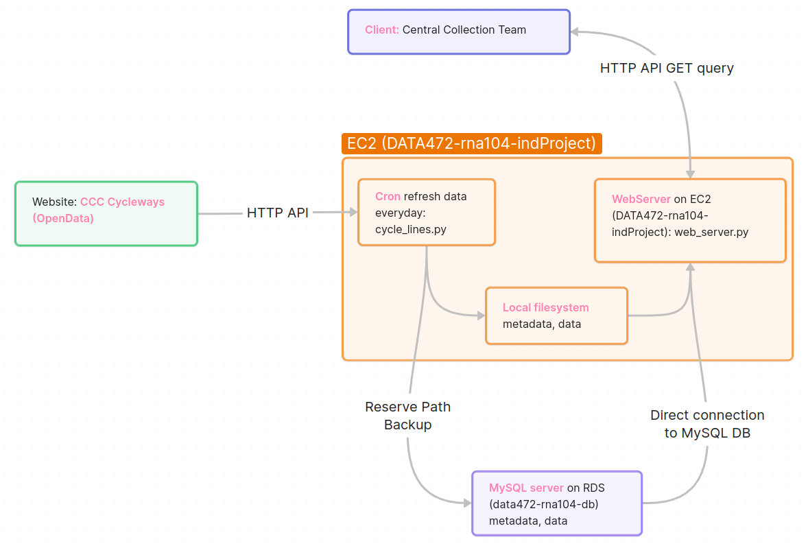
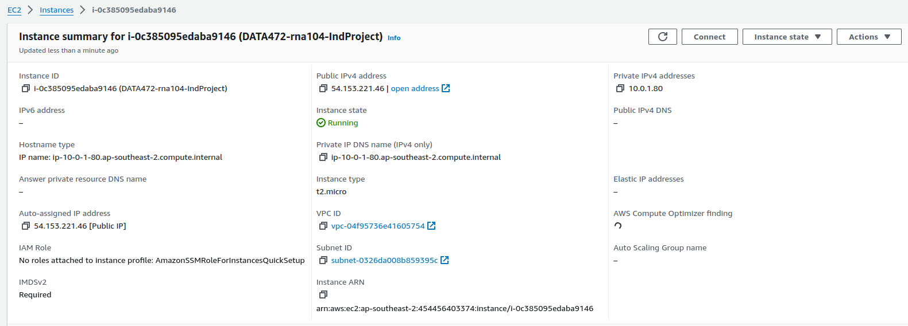
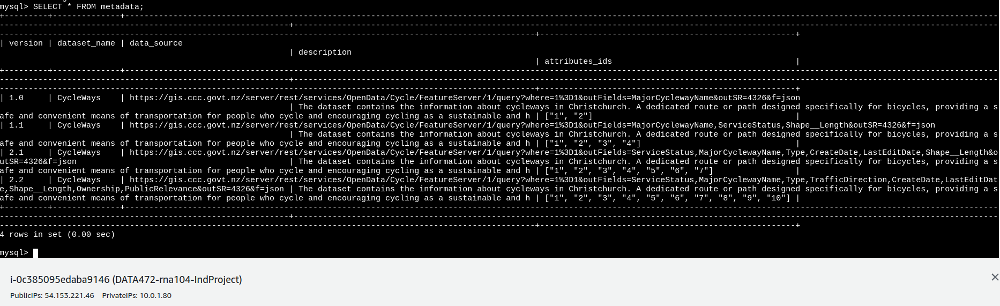
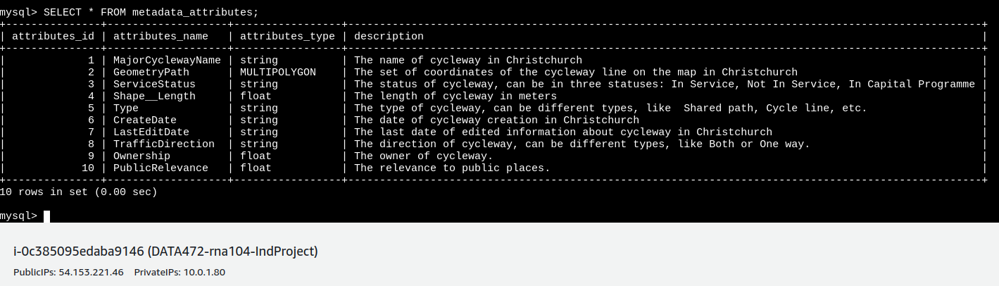
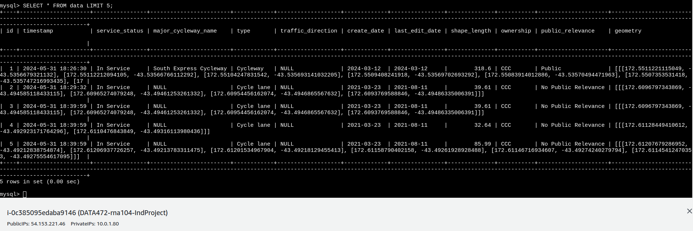
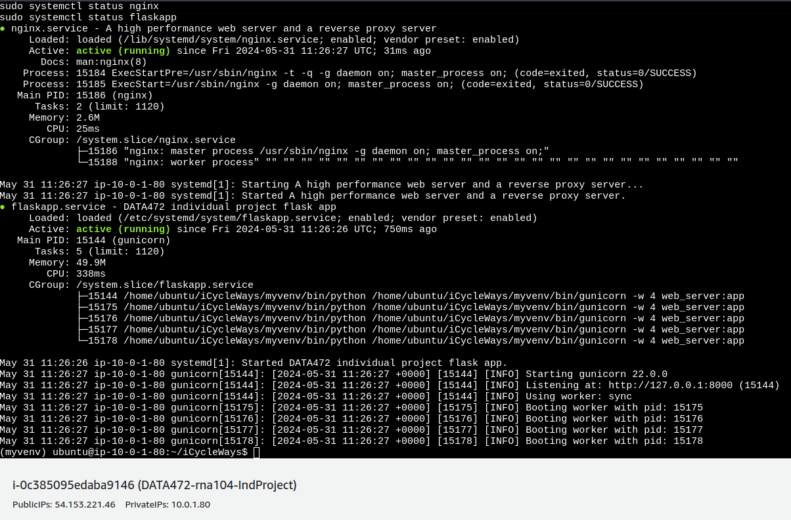

# `Cycle Ways in Christchurch` Individual Project for DATA472 course at the University of Canterbury

## Cycle Ways Individual Project 

The project is built on AWS using EC2 and MySQL on RDS. The project collects information about cycle paths in Christchurch, New Zealand. The data was taken from an open source via the API https://opendata-christchurchcity.hub.arcgis.com/datasets/ChristchurchCity::cycleway-opendata/api.

## System architecture

The architecture of the system is shown in the picture below. Information is collected daily from the data source and stored both in the local file system in files on EC2, and in the database in tables. When writing to the database, a check for duplicates is carried out; if the information is new, then records are updated/added; if the information exists, then the insertion of new rows is ignored. Priority in generating an API response for the client is given to the file system. Those. An attempt is made to obtain data from the files, and if for some reason it does not work, then the database is accessed and the data is retrieved from the tables.



API requests are formed according to the following endpoint and rules.

Endpoint: **/cyclewaysapimeta**

`http://<IP-ADDRESS>/<YOUR-USERNAME>/cyclewaysapimeta?key=<YOUR-API-KEY>&version=<YOUR-VERSION>` - There are currently 4 versions of metadata: 1.0, 1.1, 2.1, 2.2

`http://<IP-ADDRESS>/<YOUR-USERNAME>/cyclewaysapimeta?key=<YOUR-API-KEY>` - return the latest version of metadata in JSON format

Endpoint: **/cyclewaysapi**

`http://<IP-ADDRESS>/rna104/cyclewaysapi?key=<YOUR-API-KEY>&data=html&version=<YOUR-VERSION>` - return the data according to the version of metadata in HTML format

`http://<IP-ADDRESS>/rna104/cyclewaysapi?key=<YOUR-API-KEY>&data=csv&version=<YOUR-VERSION>` - return the data according to the version of metadata in CSV format

`http://<IP-ADDRESS>/rna104/cyclewaysapi?key=<YOUR-API-KEY>&data=json&version=<YOUR-VERSION>` - return the data according to the version of metadata in JSON format

`http://<IP-ADDRESS>/rna104/cyclewaysapi?key=<YOUR-API-KEY>`  - return the data according to the latest version of metadata in JSON format

The data format is also checked. If it is incorrect, an error message is displayed. If a metadata version is entered that does not exist, the most recent version is returned.

Examples of requests to a running system are as follows:

`http://54.153.221.46/rna104/cyclewaysapimeta?key=****&data=json&version=2.2` - metadata

`http://54.153.221.46/rna104/cyclewaysapi?key=****&version=2.2` - data


## Info how to deploy overall system into Amazon Cloud (AWS)

The pipeline how to deploy overall system into Amazon Cloud (AWS) is described below.

### 1. Clone this repository into your folder on local machine

```
cd PATH-YOUR-LOCAL-DIRECTORY
git clone https://github.com/romanaumov/Individual-Data-Engineering-Project.git
```

### 2. Create a AWS EC2 for WebServer instance

Follow the instructions from Paul Benden, access on LEARN (University of Canterbury internal page, only for students) in the AWS Resources chapter of this course.   

Additionally, basic information how to create and tune your EC2 instance you can find on the official AWS website here: https://docs.aws.amazon.com/AWSEC2/latest/UserGuide/EC2_GetStarted.html


### 3. AWS setup on EC2 (WebServer)

1. To work with EC2 instance you should connect to this virtual environment. You can do it using `ssh` or just use AWS web interface to click the `Connect` button on the top right corner of EC2 instance page and select the tab `EC2 Instance Connect` by default, you will be able to connect to the instance without any further setup.



2. Copy the local folder on your machine to EC2 home directory running the command below on your local machine in terminal

```
cd <PATH-YOUR-LOCAL-DIRECTORY>iCycleWays
scp -i <PATH-TO-YOUR-PEM-KEY-ON-LOCAL-MACHINE> -r iCycleWays ubuntu@<EC2-PUBLIC-IP-ADDRESS>:/home/ubuntu/
```


### 4. Setup Flask app environment on EC2 (WebServer)

1. Using bash on EC2 create the `venv` folder in the `iCycleWays` folder and activate this environment using the following commands:
2. Enter to the folder `iCycleWays` using the command `cd iCycleWays`

```bash
sudo apt-get update
sudo apt install python3-virtualenv
virtualenv -p python3 venv
source venv/bin/activate
```

3. Install the required packages using the command: 

```bash
pip install requirements.txt
```

4. Finally, your app folder should be like the following:

```
iCycleWays/
├────────── data/
│             ├── metadata/
│             └── cycle_lines.csv/
├────────── flaskapp.service
├────────── config
├────────── logs
├────────── requirements.txt
├────────── create_db.py
├────────── cycle_lines.py
├────────── insert_attributes.py
├────────── templates/
│             ├── csv.html
├────────── venv/
│             ├── bin/
│             ├── lib/
│             └── pyvenv.cfg
└────────── web_server.py
```

`data` - contains metadata and data files

`config` - contains sensitive information for connecting to parts of the system

`logs` - system logs

`templates` - template for displaying the HTML page

`create_db.py` - creating a database and tables

`cycle_lines.py` - request data from the source and save it in the database and file system

`insert_attributes.py` - filling database tables with metadata

`web_server.py` - main web server file


### 5. Setup environmental variables on EC2

1. Replace environmental variables for connection to database in the file `iCycleWays/config/config.yaml`

```bash
db_name: "<your_db_name>"
db_user: "<your_db_user>"
db_password: "<your_db_password>"
db_host: "<your_db_host>"
api_key: "<your_secret_key>"
```

### 6. Create Individual MySQL DB on RDS

1. Run the script `create_db.py` in the terminal for creating database and tables using the command `python3 create_db.py`.

The following tables will be created `data`, `metadata` and `metadata_attributes` in the database `individual_db`.

Examples of database tables after creation and data inserting please see below:








### 7. Setup Gunicorn environment on EC2

1. Copy a `flaskapp.service` file from `iCycleWays` to the `/etc/systemd/system/` folder using the command 

```bash
sudo mv flaskapp.service /etc/systemd/system/
```

Note: If your EC2 instance image is not ubuntu, you should replace the `ubuntu` with the correct user name in the `flaskapp.service` file.

2. Enable the service by running the following command:

```bash
sudo systemctl start flaskapp
sudo systemctl enable flaskapp
```

### 8. Setup Nginx environment on EC2 

1. Install nginx by running the following command:

```bash
sudo apt-get update
sudo apt-get install nginx
```

2. Start Nginx:

```bash
sudo systemctl start nginx
```

3. Enable Nginx reverse proxy by updating a file named `default` in the `/etc/nginx/sites-available/` folder. You should replace the IP address in the file with your `EC2-PUBLIC-IP-ADDRESS` IP address.

```bash
server {
        listen 80 default_server;
        listen [::]:80 default_server;

        root /var/www/html;
        index index.html index.htm index.nginx-debian.html;

        server_name <EC2-PUBLIC-IP-ADDRESS>;

        location / {
                proxy_pass         http://127.0.0.1:8000/;
                proxy_redirect     off;

                proxy_set_header   Host                 $host;
                proxy_set_header   X-Real-IP            $remote_addr;
                proxy_set_header   X-Forwarded-For      $proxy_add_x_forwarded_for;
                proxy_set_header   X-Forwarded-Proto    $scheme;
        }
}
```

4. Restart Nginx by running the following command:

```bash
sudo systemctl restart nginx
```



Now the web application will be available at the EC2 public IP address from the browser. `http://<EC2-PUBLIC-IP-ADDRESS>`


### 9. Schedule tasks using Cron on EC2

To periodically update prediction files, they need to be obtained from the S3 File server. For this, Cron is used with a schedule for collecting files every hour.

1. Grant file execution rights to copy prediction files from the S3 File server.

`chmod +x get_insert_data.sh`

2. Using the command `crontab -e` add the following entry to run the script every hour

`0 */24 * * * /home/ubuntu/iCycleWays/get_insert_data.sh`

3. Check if the entry was successfully added to the Cron table, run the command `crontab -l`

4. Restart Cron and check the status

```bash
sudo systemctl stop cron
sudo systemctl start cron
sudo systemctl enable cron
sudo systemctl status cron
```

## Metadata example
The metadata file includes a dataset description, source URL, and version number:

```json
{
    "Dataset Name": "CycleWays",
    "Data Source": "https://gis.ccc.govt.nz/server/rest/services/OpenData/Cycle/FeatureServer/1/query?where=1%3D1&outFields=MajorCyclewayName,ServiceStatus,Shape__Length&outSR=4326&f=json",
    "Description": "The dataset contains the information about cycleways in Christchurch. A dedicated route or path designed specifically for bicycles, providing a safe and convenient means of transportation for people who cycle and encouraging cycling as a sustainable and healthy mode of transportation. It is spatially abstracted to a Line.",
    "Version": "1.1",
    "Attributes":[
        {
            "id": "1",
            "field":"MajorCyclewayName",
            "type":"string",
            "description":"The name of cycleway in Christchurch"
        },
        {
            "id": "2",
            "field":"GeometryPath",
            "type":"MULTIPOLYGON",
            "description":"The set of coordinates of the cycleway line on the map in Christchurch"
        },
        {
            "id": "3",
            "field":"ServiceStatus",
            "type":"string",
            "description":"The status of cycleway, can be in three statuses: In Service, Not In Service, In Capital Programme"
        },
        {
            "id": "4",
            "field":"Shape__Length",
            "type":"float",
            "description":"The length of cycleway in meters"
        }
    ]
}
```

## Logging proccess

The logging library was used for logging. The files are generated in the logs folder and contain two levels of criticality:

**info** - contains information about the execution of processes connecting to the database, writing to the database, writing to files on disk, etc.

**error** - contains information about errors or incorrectly entered data into the API request and intercepted by the server.


## Conclusion

The entire Cycle Ways project was developed from scratch (from idea to implementation) within weeks of the DATA472 course and fully deployed on AWS. The system consists of many objects, such as the Web server, Database, Logging, API integration part, Reserving path, Schedule tasks using Cron:

1. **Flask, Gunicorn and Nginx** were used for Web server. 
2. **MySQL connector** library for interaction with database. 
3. **Logging** library to log any messages. 

## Future tasks
- Automate the information collection process even better.
- Improve logging of the entire system.
- Implement AirFlow, Docker Terraform for more efficient system management, deployment and management.

If you have any questions, please feel free to ask us.